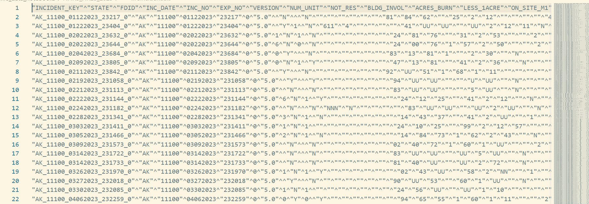
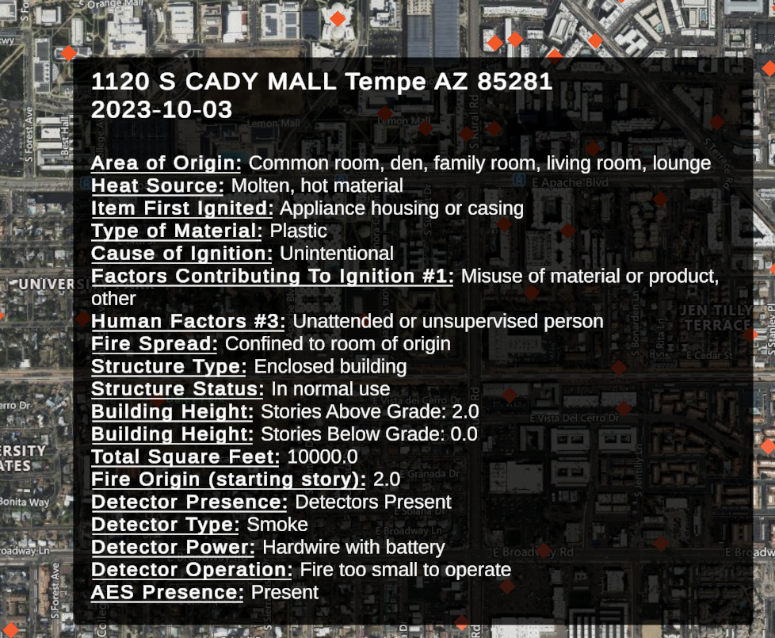
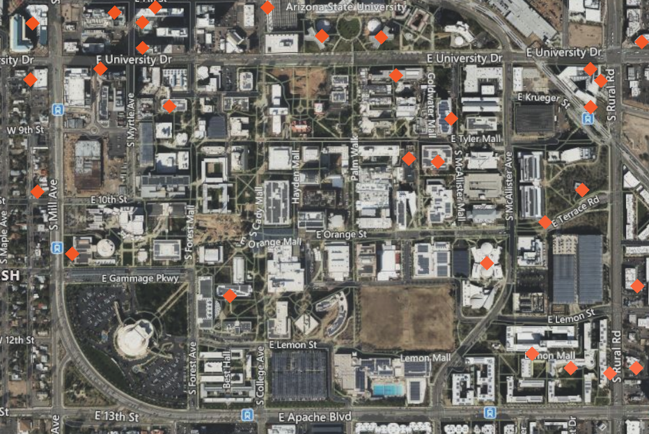

# Every building fire in Tempe, Arizona from 2020-2023

*Data from FEMA NFIRS, visualized in Unity using Cesium*

This is a Python + Unity project which extracts information about building fires from U.S. government NFIRS data, rendering them in a Unity project with Cesium map tiles.

## Demo .gifs

## Summary

Python Jupyter notebooks are used to process the NFIRS raw data, year by year, and convert it to a GeoJSON file.

Google Maps [Geocoding API](https://developers.google.com/maps/documentation/geocoding/overview) is used to convert plaintext addresses into longitude/latitude coordinate pairs.

This file is then imported to Unity and overlaid onto Cesium 3D tiles for an interactive data viewer with tooltips and date filtering.

## Step 1: Raw NFIRS data import and cleaning

This data, along with accompanying `incidentaddress` and `codelookup` tables, is cleaned and preprocessed using a [Jupyter notebook](.nfirs_data_notebooks/1_fire_data.ipynb), replacing all alphanumeric codes with plaintext English.

For example, `NO_SPR_OP=2` is changed to "**Number of Sprinklers Operating: 2**", and `ON_SITE_M1=531` to "**On Site Materials #1: Charcoal**".

The address of each building fire is also parsed out from individual columns.

## Step 2: Geocoding via Google Maps API

[Jupyter notebook #2](.nfirs_data_notebooks/2_geocode.ipynb.ipynb) sends each address through the Google Maps [Geocoding API](https://developers.google.com/maps/documentation/geocoding/overview), retrieving the longitude and latitude coordinate pairs.

After combining each year's data using [Jupyter notebook #3](.nfirs_data_notebooks/3_merge_geojson.ipynb), I create a GeoJSON file that contains all the NFIRS data combined with the coordinate pair and other helper columns.

**View the GeoJSON file on a 2D interactive map:** [fires-2020-23.json](https://github.com/alexvng/nfirs-unity-visualization/blob/02e6b9596ff596484bbc59d7a34b50621132f667/Assets/fires-2020-23.json)

## Step 3: Building the Unity viewer

I import the GeoJSON file to Unity and place the coordinates onto Cesium 3D tiles as a `FireMarker` Prefab, which pipes data to the mouseover tooltip.

Here is an example of a minor fire in the INTDS building at Arizona State University.

Pressing `SPACE` allows you to switch into freecam mode, teleporting you to the point at the center of your screen. Pressing `1` and `2` toggles the map tiles provider:

1. 3D tiles from Cesium's Google Earth integration.

2. 2D tiles with street labels from Bing Maps.

## Next steps

I intend to generalize the NFIRS data-cleaning code to have it work on all NFIRS v5.0 format data (everything from 2010 onwards) and pack it into a GeoJSON. This would open up 10 years' worth of firefighting data to be visualized across the whole country, using either this Unity project or standard GIS workflows.

## Contact me:

LinkedIn: https://www.linkedin.com/in/alex-vuong-49003a208/
