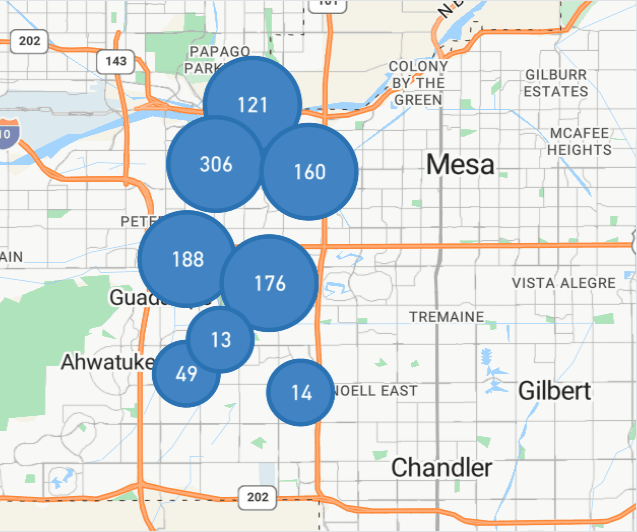

# Every building fire in Tempe, Arizona from 2020-2024

This is a Python + Unity project which extracts addresses from the U.S. FEMA [National Fire Incident Reporting System](https://www.usfa.fema.gov/nfirs/access-data/), also known as NFIRS.

Python Jupyter notebooks in [./nfirs_data_notebooks](.nfirs_data_notebooks/1_fire_data.ipynb) are used to process the NFIRS raw data, year by year, and convert it to a GeoJSON file.

This file is then imported to Unity and overlaid onto Cesium 3D tiles for an interactive data viewer:

## Raw GeoJSON view:

View the created GeoJSON file by itself:

)
